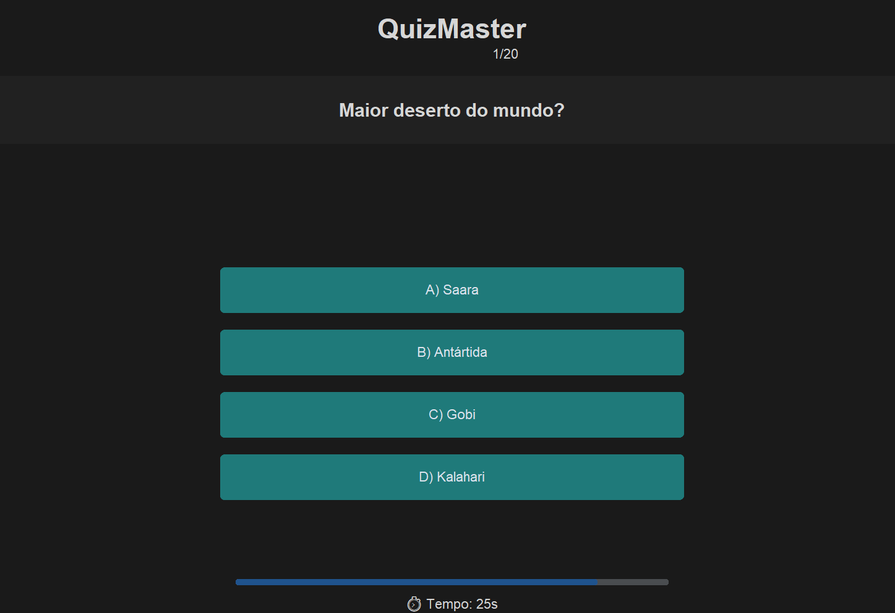

# 🧠 QuizMaster – Sistema de Quiz Interativo


---

## 📸 Demonstração do Sistema

Visualize abaixo as principais interfaces do QuizMaster em funcionamento:

<p align="center">
  <h3>🏠 Tela Inicial e Identificação</h3>
  
</p>

<p align="center">
  <h3>⏱️ Seleção de Modo de Jogo</h3>
  
</p>

<p align="center">
  <h3>🎮 Gameplay com Timer Progressivo</h3>
  
</p>

---

## 📌 Sobre o Projeto
O **QuizMaster** é uma aplicação desktop desenvolvida para oferecer uma experiência de jogo educativa e dinâmica. Com uma interface moderna baseada em **CustomTkinter**, o projeto desafia o usuário com perguntas de conhecimentos gerais, contando com um sistema de tempo real, feedbacks visuais e sonoros, além de um ranking competitivo local.

---

## ✨ Funcionalidades
- ⏱️ **Modos de Jogo:** Escolha entre jogar contra o tempo (30s por pergunta) ou no modo relaxado.
- 📊 **Dificuldade Selecionável:** Opções de 10, 20 ou 30 perguntas por rodada.
- 🏆 **Ranking Local:** Gravação automática dos melhores scores (Top 3) por categoria de dificuldade.
- 🎨 **Interface Responsiva:** Mudança de cores dinâmica para acertos e erros.
- 🔊 **Efeitos Sonoros:** Integração com `winsound` para imersão durante as respostas.
- 👤 **Personalização:** Identificação de jogadores para registro de recordes.

---

## 🛠️ Tecnologias Utilizadas
- **Linguagem:** Python 3.10+
- **Interface Gráfica:** CustomTkinter (UI moderna)
- **Efeitos Sonoros:** Módulo `winsound` (Nativo Windows)
- **Lógica de Dados:** Módulo `random` e manipulação de arquivos `.txt`
- **Documentação:** Markdown

---

## 📘 Documentação
Consulte os manuais detalhados para entender a arquitetura e operação:

* [📄 **Documentação Técnica**](./docs/tecnico.md): Estrutura do código, variáveis globais e lógica do timer.
* [👤 **Manual do Usuário**](./docs/manual_usuario.md): Guia de instalação, como jogar e visualização do ranking.

---

## 🚀 Melhorias Futuras
- [ ] 🌐 **Banco de Dados Online:** Sincronizar rankings globais via API.
- [ ] 📁 **Categorias de Perguntas:** Filtros por temas (História, Ciência, Games).
- [ ] 🖼️ **Suporte a Imagens:** Adicionar fotos nas perguntas para maior interatividade.
- [ ] 🌓 **Modo Light/Dark:** Toggle manual de tema na interface principal.

---

## 📄 Licença
Este projeto está sob a **Licença MIT**. Sinta-se à vontade para utilizar para fins educacionais ou expandir o código.

---

## ⚙️ Instalação e Execução

1. **Clone o repositório:**
   ```bash
   git clone [https://github.com/emival122/quiz-adivinhacao-python.git](https://github.com/emival122/quiz-adivinhacao-python.git)
